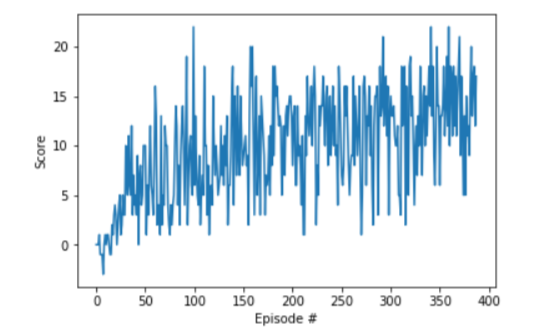

## Solution Summary

For solving this project, a simple **Deep Q-Network** or **DQN** was used.

## Learning Algorithm

#### 1. Deep Q-Network (DQN)

As reinforcement learning algorithm, I implemented a vanilla DQN as demonstrated in lessons prior to this project.
The Deep Q-Learning algorithm represents the optimal action-value function q* as a neural network (instead of a table). Hence, instead of representing the action values in a small finite table, neural networks are employed to expand the size of the problems that we can solve with reinforcement learning. This helps in capturing a much wider state space and estimating optimal actions for even previously unvisited states. The weights for the the trained network can be found [here](checkpoint.pth).

Inside the DQN, I used three layer neural network as Q-Value Estimator. Hidden layers are composed of `State -> 64 -> ReLU -> 128 -> ReLU -> 256 -> Action`.

#### 2. Experience Replay and Fixed Q-Targets

Similarly to original DQN paper, Experience Replay and Fixed Q Targets were used. Reinforcement learning is notoriously unstable when neural networks are used to represent the action values. In the Deep Q-Learning algorithm, these instabilities are addressed by using two key features- Experience Replay & Fixed Q-Targets. In this technique, DQN model is trained by mini-batch from replay buffer having size 100000.

#### 3. Other hyperparams:

At probability epsilon, agent select at random from action space. The value of epsilon is set 0.995, and decrease gradually with time until 0.01.
Gamma or discount factor is kept to be 0.99.

## Result

 At Episode 388, agent performance met the criteria and stopped training. (mean scores of last 100 episodes is above +13)
 
 
 
## Further improvements

Other modifications and network architectures can be used to improve the performance of DQNs:
- Double DQN (DDQN)
- Prioritized experience replay
- Dueling DQN
- Distributional DQN
- Noisy DQN
