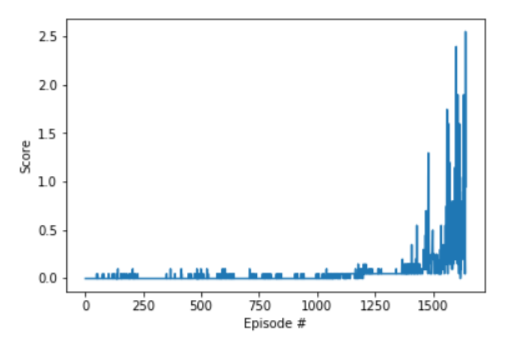

## Solution Summary

For solving this project, a simple single-agent **Deep Deterministic Policy Gradient** or **DDPG** was used.

#### 1. Policy-based vs Value-based Methods

Given the complexity of this environment, **value-based methods** are not suitable &mdash; i.e., the Deep Q-Network (DQN) algorithm. 
Hence, we need an algorithm that allows the robotic arm to utilize its full range of movement.
For this, we'll need to explore a different class of algorithms called **policy-based methods**.

Here are some advantages of policy-based methods:
- **Continuous action spaces** &mdash; Policy-based methods are well-suited for continuous action spaces.
- **Stochastic policies** &mdash; Both value-based and policy-based methods can learn deterministic policies. However, 
policy-based methods can also learn true stochastic policies.
- **Simplicity** &mdash; Policy-based methods directly learn the optimal policy, without having to maintain a separate value
function estimate. With value-based methods, the agent uses its experience with the environment to maintain an estimate of the 
optimal action-value function, from which an optimal policy is derived. This intermediate step requires the storage of lots of
additional data since you need to account for all possible action values. Even if you discretize the action space, the number of
possible actions can be quite high. For example, if we assumed only 10 degrees of freedom for both joints of our robotic arm, 
we'd have 1024 unique actions (2<sup>10</sup>). Using DQN to determine the action that maximizes the action-value function within 
a continuous or high-dimensional space requires a complex optimization process at every timestep.

#### 2. Deep Deterministic Policy Gradient (DDPG)
The algorithm I chose to model my project on is outlined in [this paper](https://arxiv.org/pdf/1509.02971.pdf), _Continuous Control with 
Deep Reinforcement Learning_, by researchers at Google Deepmind. In this paper, the authors present "a model-free, off-policy actor-critic 
algorithm using deep function approximators that can learn policies in high-dimensional, continuous action spaces." 
They highlight that DDPG can be viewed as an extension of Deep Q-learning to continuous tasks.
 
I further experimented with the DDPG algorithm based on other concepts covered in Udacity's classroom and lessons. My understanding and 
implementation of this algorithm (including various customizations) are discussed below.

#### 3. Actor-Critic Method

Actor-critic methods leverage the strengths of both policy-based and value-based methods.

Using a policy-based approach, the agent (actor) learns how to act by directly estimating the optimal policy and maximizing reward
through gradient ascent. Meanwhile, employing a value-based approach, the agent (critic) learns how to estimate the value (i.e., the 
future cumulative reward) of different state-action pairs. Actor-critic methods combine these two approaches in order to accelerate 
the learning process. Actor-critic agents are also more stable than value-based agents, while requiring fewer training samples than 
policy-based agents.

You can find the actor-critic logic implemented as part of the `Agent()` class 
[here](p3_collab-compet/agent.py) 
in `agent.py` of the source code. The actor-critic models can be found via their respective `Actor()` and `Critic()` classes 
[here](p3_collab-compet/model.py) in `model.py`.

The local and target networks are implemented separately for both the actor and the critic, to improve stability. This is so that one 
set of parameters `w` is used to select the best action, while another set of parameters `w'` is used to evaluate that action.

#### 4. Exploration vs Exploitation
One challenge is choosing which action to take while the agent is still learning the optimal policy. Should the agent choose an action
based on the rewards observed thus far? Or, should the agent try a new action in hopes of earning a higher reward? 
This is known as the **exploration vs. exploitation dilemma**.


Here we use the **Ornstein-Uhlenbeck process**, as suggested in the previously mentioned [paper by Google DeepMind]
(https://arxiv.org/pdf/1509.02971.pdf) (see bottom of page 4). The Ornstein-Uhlenbeck process adds a certain amount of noise to the 
action values at each timestep. This noise is correlated to previous noise, and therefore tends to stay in the same direction for 
longer durations without canceling itself out. This allows the arm to maintain velocity and explore the action space with more 
continuity.

You can find the Ornstein-Uhlenbeck process implemented [here](p3_collab-compet/agent.py) in the `OUNoise` class in 
`agent.py` of the source code.

In total, there are five hyperparameters related to this noise process.

The Ornstein-Uhlenbeck process itself has three hyperparameters that determine the noise characteristics and magnitude:
- mu: the long-running mean
- theta: the speed of mean reversion
- sigma: the volatility parameter


Notice also there's an epsilon parameter used to decay the noise level over time. This decay mechanism ensures that more noise is 
introduced earlier in the training process (i.e., higher exploration), and the noise decreases over time as the agent gains more 
experience (i.e., higher exploitation). The starting value for epsilon and its decay rate are two hyperparameters that were tuned
during experimentation.

The final noise parameters were set as follows:

```python
OU_SIGMA = 0.2          # Ornstein-Uhlenbeck noise parameter
OU_THETA = 0.15         # Ornstein-Uhlenbeck noise parameter
EPSILON = 1.0           # explore->exploit noise process added to act step
```

## Result

At Episode 1641, agent performance met the criteria and stopped training.
Our agent was able to solve the Tennis environment with an average reward of +0.5.



## Further improvements
- **Experiment with other algorithms** &mdash; Tuning the DDPG algorithm required a lot of trial and error. 
Perhaps another algorithm such as [Trust Region Policy Optimization (TRPO)](https://arxiv.org/abs/1502.05477), 
Proximal Policy Optimization (PPO), or [Distributed Distributional Deterministic Policy Gradients (D4PG)](https://arxiv.org/abs/1804.08617) would be more robust.

- **Add *prioritized* experience replay** &mdash; Rather than selecting experience tuples randomly, prioritized replay selects 
experiences based on a priority value that is correlated with the magnitude of error. This can improve learning by increasing the 
probability that rare and important experience vectors are sampled.

- **Different replay buffer for actot and critic**
